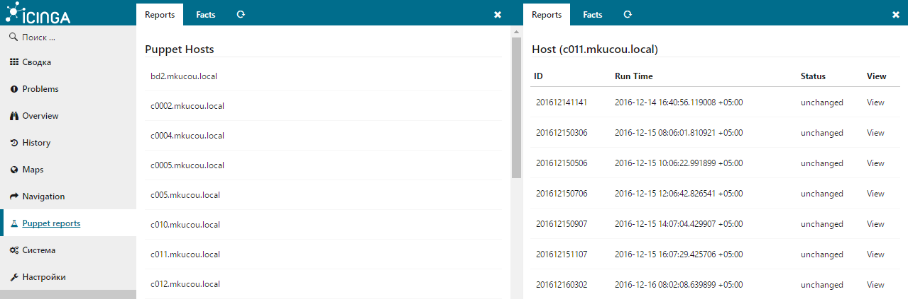
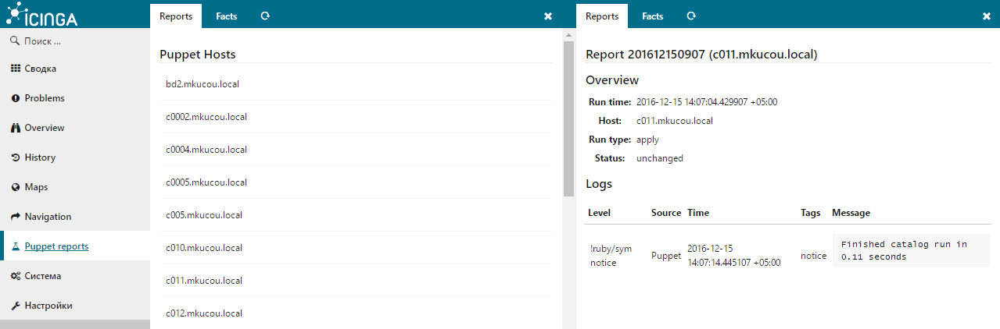
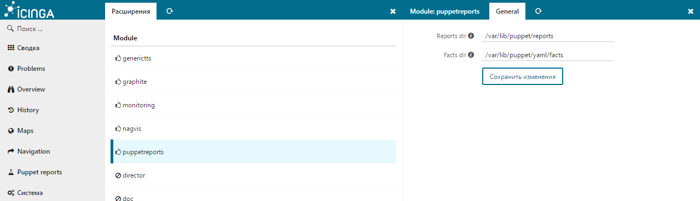

# Icinga Web 2 - Puppet reports module


#### Table of Contents

1. [About](#about)
2. [License](#license)
3. [Support](#support)
4. [Requirements](#requirements)
5. [Installation](#installation)
6. [Configuration](#configuration)
7. [FAQ](#FAQ)

## About






## License

Icinga Web 2 and this Icinga Web 2 module are licensed under the terms of the GNU General Public License Version 2, you will find a copy of this license in the LICENSE file included in the source package.


## Requirements

  * [Icinga Web 2](https://www.icinga.com/products/icinga-web-2/) (>= 2.4.1)
  * [PHP](https://www.php.net)


## Instalation


Extract this module to your Icinga Web 2 modules directory as `puppetreports` directory.

Git clone:

```
cd /usr/share/icingaweb2/modules
git clone https://github.com/plsatin/icingaweb2-module-puppetreports.git hardwareinfo
```

Enable the module in the Icinga Web 2 frontend in `Configuration -> Modules -> puppetreports -> enable`.
You can also enable the module by using the `icingacli` command:

```
icingacli module enable puppetreports
```


## Configuration

### Global Configuration

You can edit global configuration settings in Icinga Web 2 in `Configuration -> Modules -> puppetreports -> General`.

Setting            | Description
-------------------|-------------------
Reports dir        | **Required.**
Facts dir          | **Required.**


## FAQ

